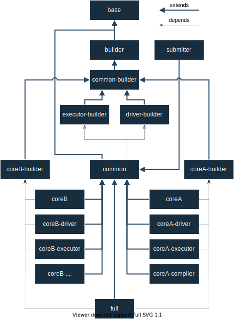

Docker Images
=============

   

----------
Background
----------

IgnisHPC is fully containerized, these can be extended to create custom runtime environments and isolate incompatible
modules. For those unfamiliar with containers, containers are running instances of an image, which is an immutable 
environment that serves as the starting point when the container is started.

IgnisHPC images are organized according to a hierarchy, shown in the figure above, which allows us to
extend and create new modules easily and simply. The images have an associated namespace that groups all the hierarchy
of images, by default it is **ignishpc** but an user can create his own. Although all images have an important role to 
play, in most cases, users should only familiarize themselves with the core images. A core container stores the IgnisHPC 
implementation for a given language as well as its dependencies. Images without an associated IgnisHPC module are stored 
in the Dockerfiles repository.

Note that only images belonging to the IgnisHPC architecture are covered, images of external dependencies are optional 
and are outside the scope of this document. 

-------
Details
-------

Base
^^^^

Base, as its name indicates, is the base image of IgnisHPC. Base is created as an extension of the official ubuntu 
image whose version is associated with the IgnisHPC version. This image only defines environment variables and creates 
the IgnisHPC folder structure, which can be customized and modify the other images easily. 

Builder
^^^^^^^

Builder extends from base and installs the most common dependencies used in compilation environments such as the GNU Compiler
Collection, the GNU Debugger and other libraries and development tools needed for software compilation. This image and its 
derivatives are only used for software construction, they are never used for code execution.

common-Builder
^^^^^^^^^^^^^^

In this image the dependencies common to the whole system are stored and compiled. 
MPI is compiled and modified from sources in this image and the thrift library is stored so that the cores do not have 
to download it.

driver-Builder
^^^^^^^^^^^^^^

This image is associated with the driver environment build, which compiles the source code and defines an installation 
script to install it in the driver runtime environment. This image belongs to the Backend module and both are stored in
the same repository.

executor-Builder
^^^^^^^^^^^^^^^^

This image is associated with the executor environment build, there is no module associated to the executor, so only the
installation script is created to install it in the executor runtime environment and compiles any dependencies if 
necessary.

common
^^^^^^

Common execution environment for the execution of all IgnisHPC modules, this image extends from base to inherit the
environment configuration. The image build depends on driver-builder and exectutor-builder, from which it obtains 
the dependencies and installation scripts for a driver and executor environment. Neither the dependencies nor the 
runtime environments are installed, they are just stored.

core-builder
^^^^^^^^^^^^

The programming languages supported by IgnisHPC are known as cores, which consist of a driver code and an executor code.
Each core has a builder image used for the compilation of sources and its dependencies and for the creation of an
installation script. The name of the image must be the name of the core with the suffix ``-builder`` and must be 
stored in the same repository as the core source code.

core images
^^^^^^^^^^^

Core images are the execution environments used by users to run their codes in IgnisHPC. The core images are three and
are generated automatically from their corresponding builder extending the common image.

 1. It has the same name as the core with suffix ``-driver``, it has the driver environment installed.
 2. It has the same name as the core with suffix ``-executor``, it has the  executor environment installed.
 3. It has the same name as the core, it has the driver and executor environment installed.

The core images have the core and its dependencies installed but can only be used as a driver or executor if its 
environment is installed. 
 
 
core helper images
^^^^^^^^^^^^^^^^^^

In some cases it is possible that a core may need an additional image. For example, compiled languages may define 
a ``-compiler`` image to facilitate the compilation process. These images are stored in the source code repository  
and should be prefixed with the core name to identify them.

full
^^^^

A full runtime Image, like the cores, is generated automatically. This image has the enviroment driver, 
the enviroment executor and all available cores installed. This is the default image for the executors 
when no image is selected.

submitter
^^^^^^^^^

This image is associated with the IgnisHPC job launch, with are launched using the ``ignis-submit``
script. The submiter module is implemented together with the backend module, so both are compiled 
in the ``driver-builder`` and the image is stored in the backend repository.
